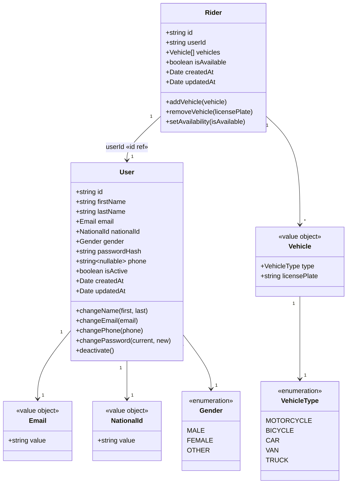
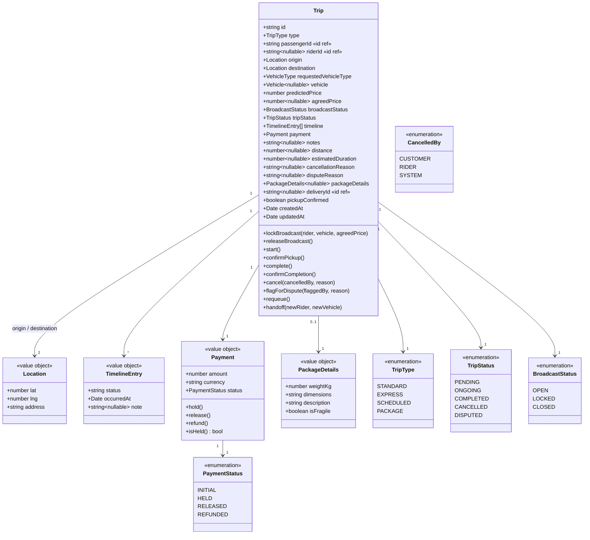
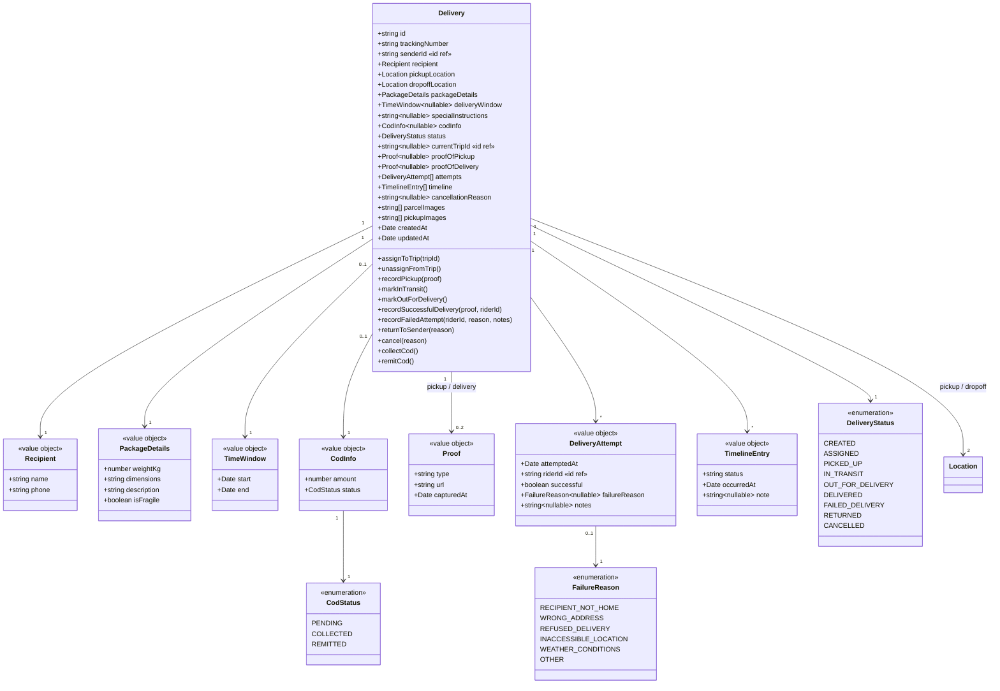
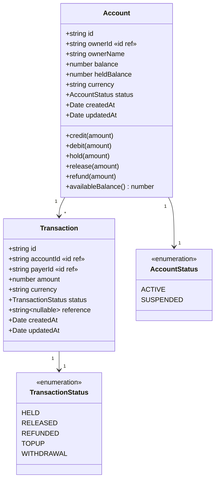
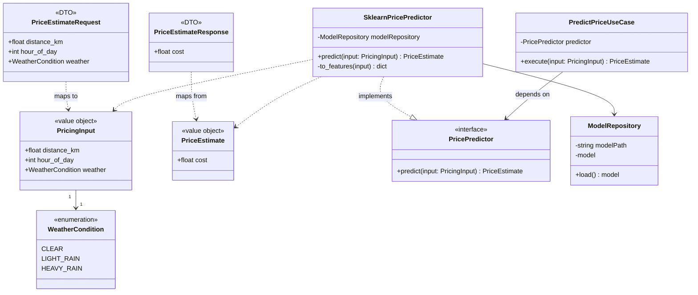

# Class Diagram

The platform is split into independently-deployable services, each owning its
own domain model (database-per-service). Cross-service references are plain
ID fields (`passengerId`, `ownerId`, `deliveryId`, ...), shown below as
dependency arrows with `«id ref»` labels rather than object composition.

## 1. User & Identity Domain (`user-service`)

## 2. Trip Domain (`trip-service`)

## 3. Delivery Domain (`delivery-service`)

## 4. Payment Domain (`payment-service`)

## 5. Pricing Domain (`pricing-service`, Python / FastAPI)

Clean-architecture layers: `domain` defines the contract, `application` orchestrates,
`infrastructure` implements it against the trained model, `presentation` exposes it over HTTP.

