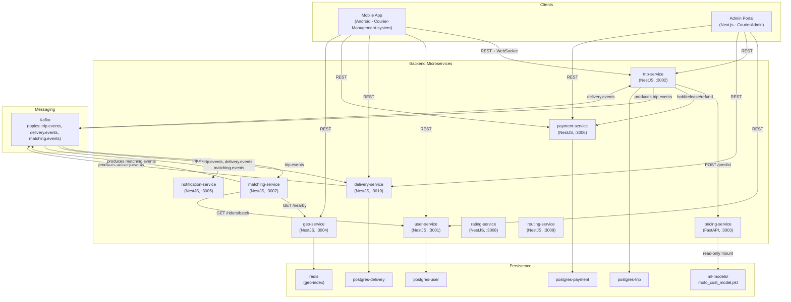

# Component Diagram

High-level view of the system's components and their dependencies: client
applications, the ten backend microservices, the shared message broker, and
each service's persistence/storage.

## Notes

- **rating-service** and **routing-service** are currently stub services
  (health-check endpoints only) and are included for completeness but have no
  meaningful dependencies yet.
- **pricing-service** is stateless: it loads `moto_cost_model.pkl` from a
  read-only volume at startup and exposes `POST /predict`. Swapping the model
  file and restarting the container is enough to update pricing behaviour
  (see `pricing-service/README.md`).
- Each NestJS service follows clean architecture internally
  (`domain` / `application` / `infrastructure` / `presentation`), and
  trip-service / delivery-service use the **outbox pattern** to publish Kafka
  events transactionally.
