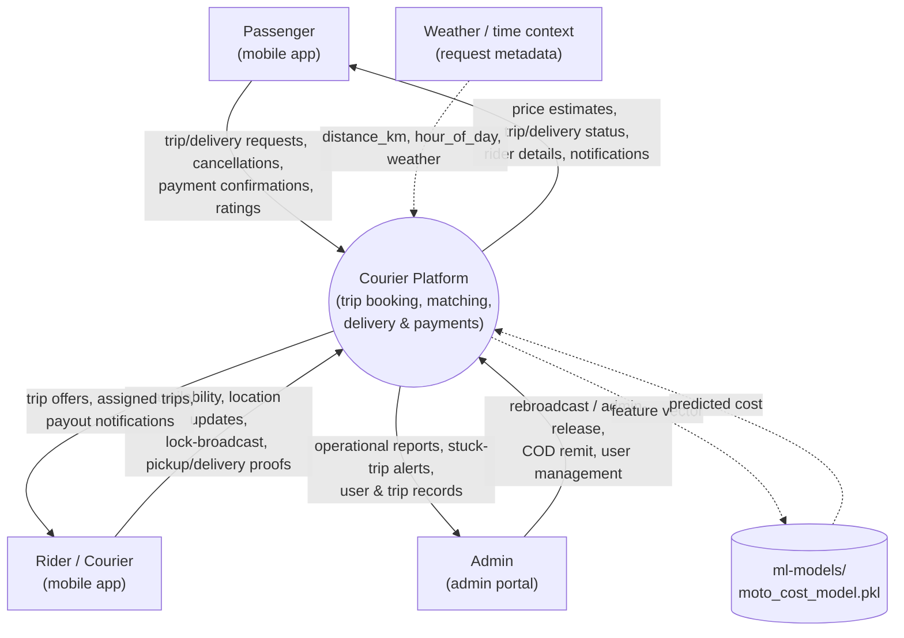
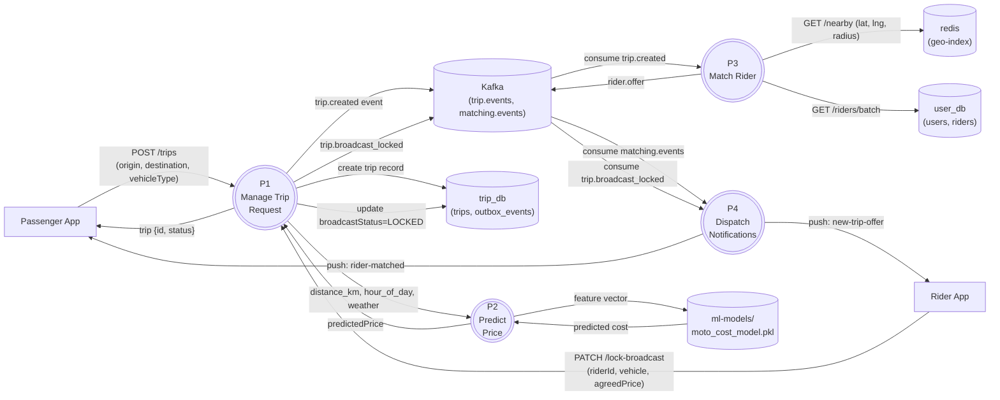
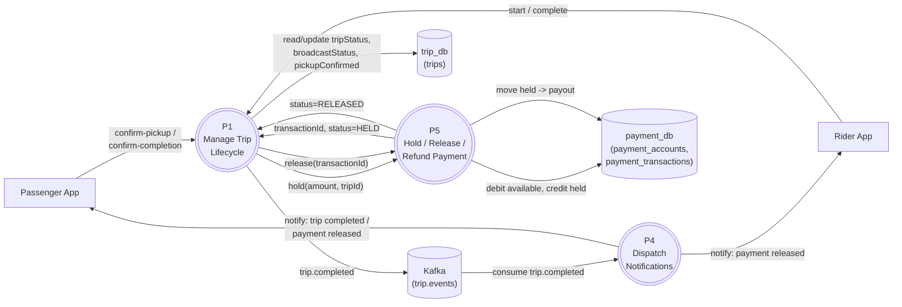
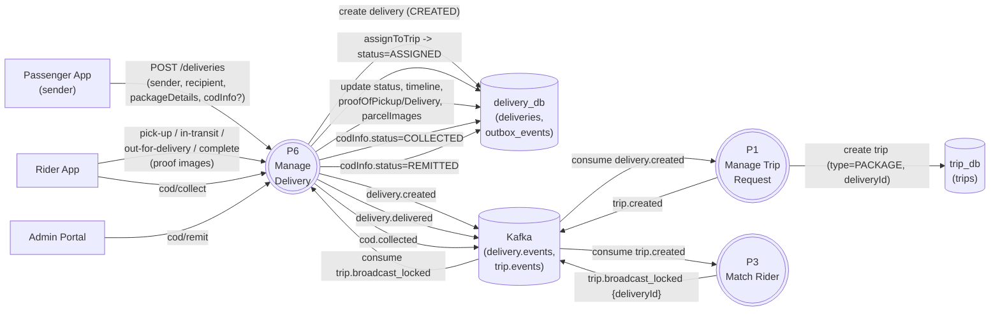
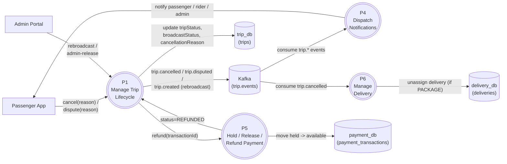

# Data Flow Diagrams

Mermaid has no native DFD shape set, so these use `flowchart` with the usual
DFD conventions:

- **Rectangles** = external entities (people / outside systems)
- **Rounded / circle nodes** = processes (transformations)
- **Cylinders** = data stores (databases, caches, files, message log)
- **Labelled arrows** = data flows

## 1. Context Diagram (Level 0)

The whole platform treated as a single process, showing the data that
crosses its boundary.

## 2. Level 1 — Ride Booking & Pricing

## 3. Level 1 — Trip Lifecycle & Payment

## 4. Level 1 — Package Delivery & COD

## 5. Level 1 — Cancellation, Dispute & Admin Release

