# Deployment Diagram

Reflects `docker-compose.yml`: every service runs as its own container on the
`courier-network` bridge network. Host ports are shown as `host:container`;
internal-only ports (Kafka's broker/controller listeners) are container-only.

```mermaid
flowchart TB
    subgraph EXTERNAL["External Clients"]
        MobileDevice["Mobile App\n(Android device / emulator)"]
        AdminBrowser["Admin Portal\n(browser, Next.js dev/prod server)"]
        Postman["Postman / curl\n(manual API testing)"]
    end

    subgraph HOST["Docker Host — network: courier-network"]
        subgraph APP["Application Containers"]
            UserSvc["user-service\n:3001"]
            TripSvc["trip-service\n:3002"]
            PricingSvc["pricing-service\n:3003\n(Python/FastAPI)"]
            GeoSvc["geo-service\n:3004"]
            NotifSvc["notification-service\n:3005"]
            PaymentSvc["payment-service\n:3006"]
            MatchingSvc["matching-service\n:3007"]
            RatingSvc["rating-service\n:3008"]
            RoutingSvc["routing-service\n:3009"]
            DeliverySvc["delivery-service\n:3010"]
        end

        subgraph DATA["Data Containers"]
            PgUser[("postgres-user\n:5435->5432\nuser_db")]
            PgTrip[("postgres-trip\n:5436->5432\ntrip_db")]
            PgDelivery[("postgres-delivery\n:5437->5432\ndelivery_db")]
            PgPayment[("postgres-payment\n:5438->5432\npayment_db")]
            RedisC[("redis\n:6379")]
            KafkaC[("kafka (KRaft)\n:9092 external\n:29092 internal")]
        end

        subgraph VOLUMES["Volumes / Bind Mounts"]
            VUser[("postgres-user-data")]
            VTrip[("postgres-trip-data")]
            VDelivery[("postgres-delivery-data")]
            VPayment[("postgres-payment-data")]
            VUploads[("delivery-uploads-data\n-> /app/uploads")]
            VMl["./ml-models\n-> /app/models (ro)"]
        end
    end

    MobileDevice -->|HTTP/WebSocket :3001-3010| HOST
    AdminBrowser -->|HTTP :3001,:3002,:3006,:3010| HOST
    Postman -->|HTTP :3003| PricingSvc

    UserSvc --> PgUser --> VUser
    TripSvc --> PgTrip --> VTrip
    DeliverySvc --> PgDelivery --> VDelivery
    DeliverySvc --> VUploads
    PaymentSvc --> PgPayment --> VPayment
    GeoSvc --> RedisC
    PricingSvc -.->|MODEL_PATH=/app/models/moto_cost_model.pkl| VMl

    TripSvc --> KafkaC
    DeliverySvc --> KafkaC
    MatchingSvc --> KafkaC
    NotifSvc --> KafkaC

    TripSvc -.depends_on.-> PgTrip
    UserSvc -.depends_on.-> PgUser
    DeliverySvc -.depends_on.-> PgDelivery
    PaymentSvc -.depends_on.-> PgPayment
    GeoSvc -.depends_on.-> RedisC
    MatchingSvc -.depends_on.-> KafkaC
    NotifSvc -.depends_on.-> KafkaC
    NotifSvc -.depends_on.-> UserSvc
```

## Container build & restart notes

| Container | Image source | Restart policy |
|---|---|---|
| `user-service`, `trip-service`, `payment-service`, `notification-service`, `matching-service`, `delivery-service` | `build:` (NestJS, multi-stage Node 20 Docker build) | `unless-stopped` |
| `geo-service`, `pricing-service`, `rating-service`, `routing-service` | `build:` | default (no restart policy) |
| `postgres-*` | `postgres:16-alpine` | default, with healthchecks gating dependents |
| `redis` | `redis:7-alpine` | default, with healthcheck |
| `kafka` | `confluentinc/cp-kafka:7.6.0`, single-node KRaft | default, with healthcheck |

`pricing-service` is the only Python container; it mounts `./ml-models` from
the host **read-only** so a retrained `moto_cost_model.pkl` can be dropped in
and picked up with `docker compose restart pricing-service` — no rebuild
needed.
