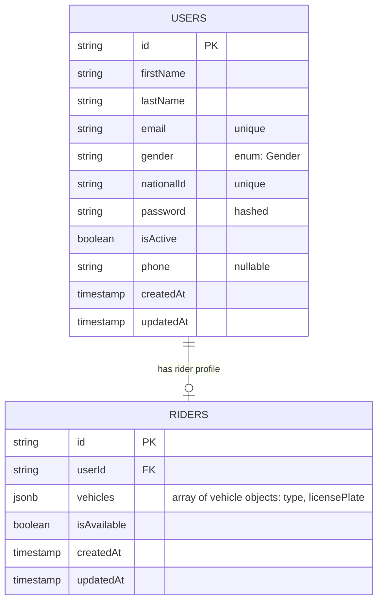
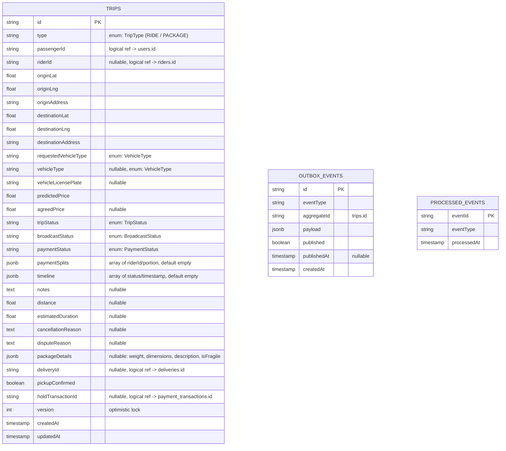
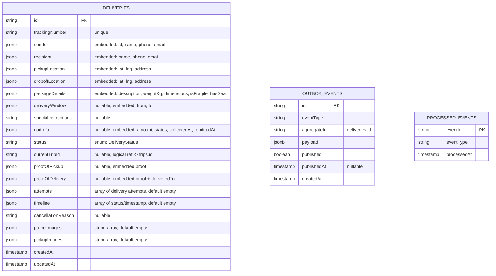
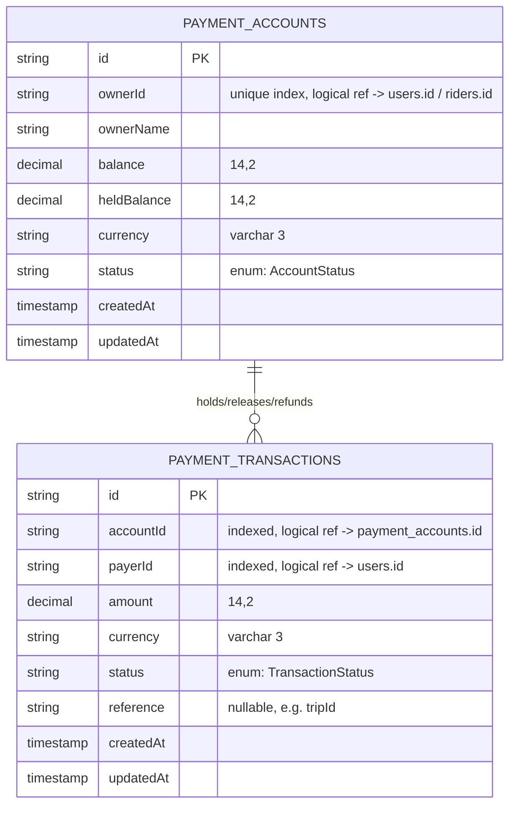
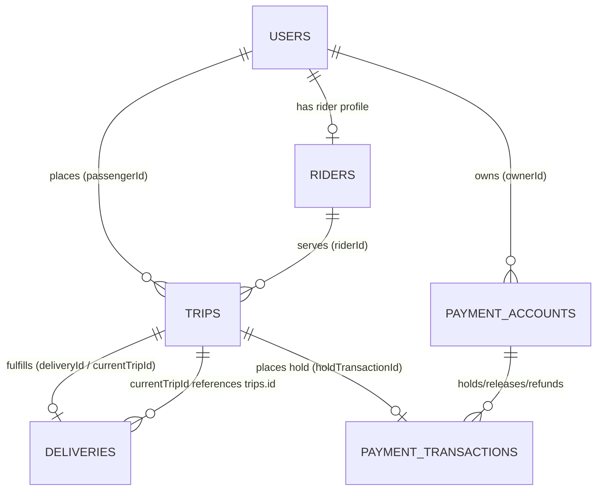

# Entity-Relationship Diagrams

Each microservice owns its own Postgres database (per `docker-compose.yml`:
`user_db`, `trip_db`, `delivery_db`, `payment_db`). There are **no real
database-level foreign keys across services** — cross-service references are
"logical" (an id stored as a plain column, validated via REST calls /
Kafka events). `pricing-service`, `geo-service`, `notification-service`,
`matching-service`, `rating-service`, and `routing-service` are stateless and
have no persisted tables.

## 1. user-service (`user_db`)

## 2. trip-service (`trip_db`)

Payment, timeline, package details and price-split information are embedded
as JSONB columns on `trips` rather than normalized into separate tables.

`outbox_events` and `processed_events` support the transactional outbox
pattern for publishing/consuming Kafka events; they are keyed by
`aggregateId` / `eventId`, not by a DB foreign key to `trips`.

## 3. delivery-service (`delivery_db`)

Sender, recipient, locations, package details, COD info, proofs and delivery
attempts are all embedded JSONB on `deliveries` — no separate
Recipient/CodInfo/Proof/DeliveryAttempt tables.

## 4. payment-service (`payment_db`)

Note: `accountId`/`payerId` are plain indexed columns, not TypeORM
`@ManyToOne` relations — the relationship is logical/application-enforced.

## 5. Cross-service logical references (high-level)

This view collapses each service's tables to their primary aggregate and
shows the **logical** (cross-database, non-enforced) relationships that tie
the system together.

