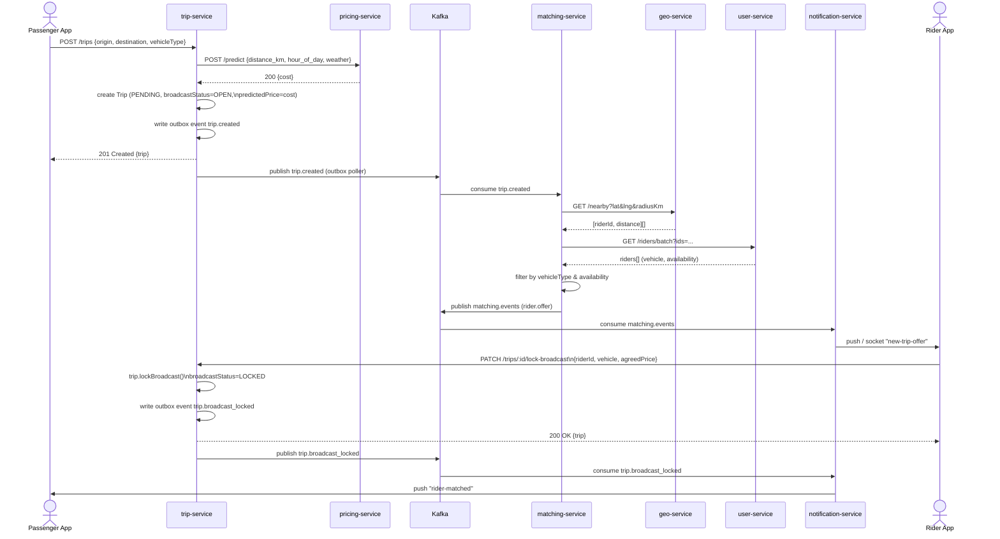
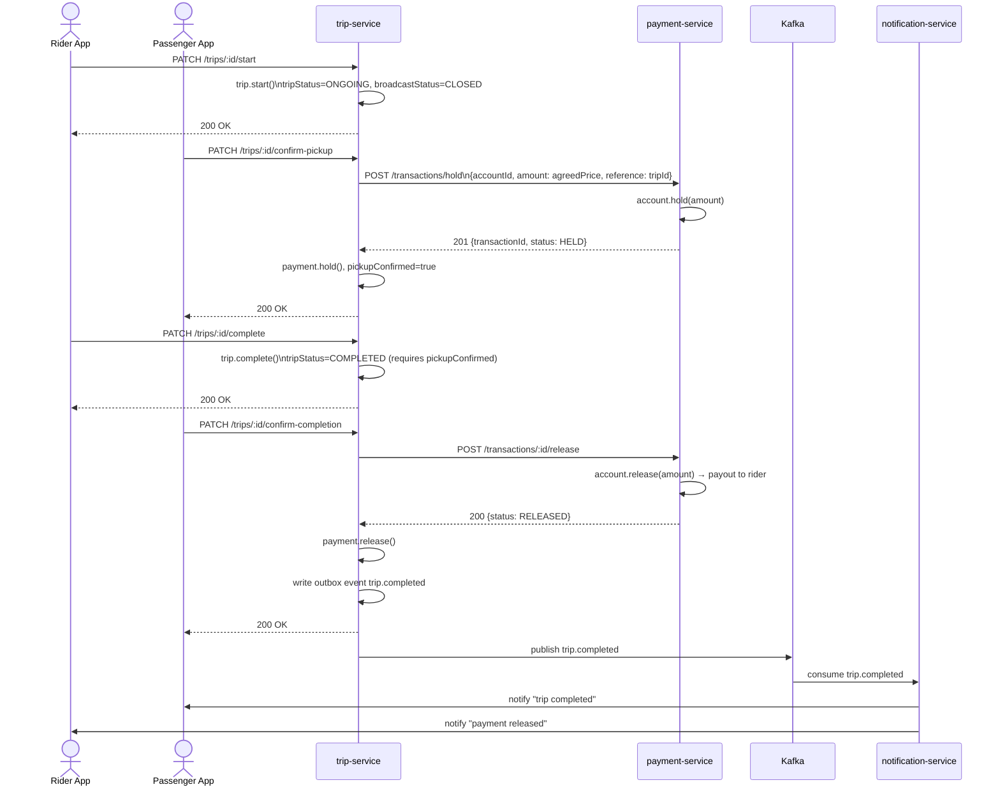
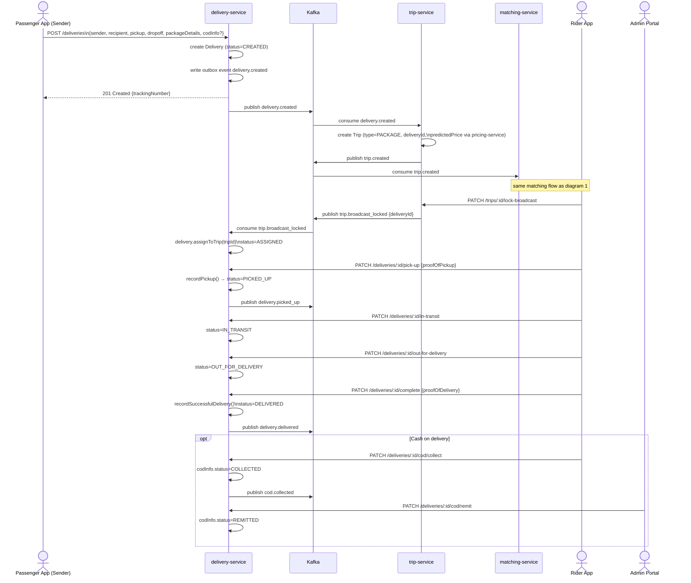
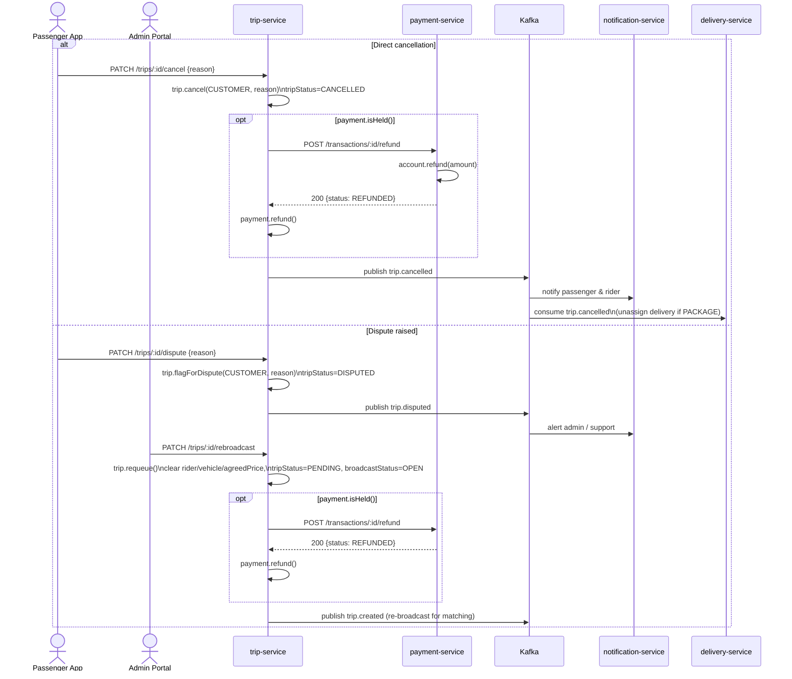
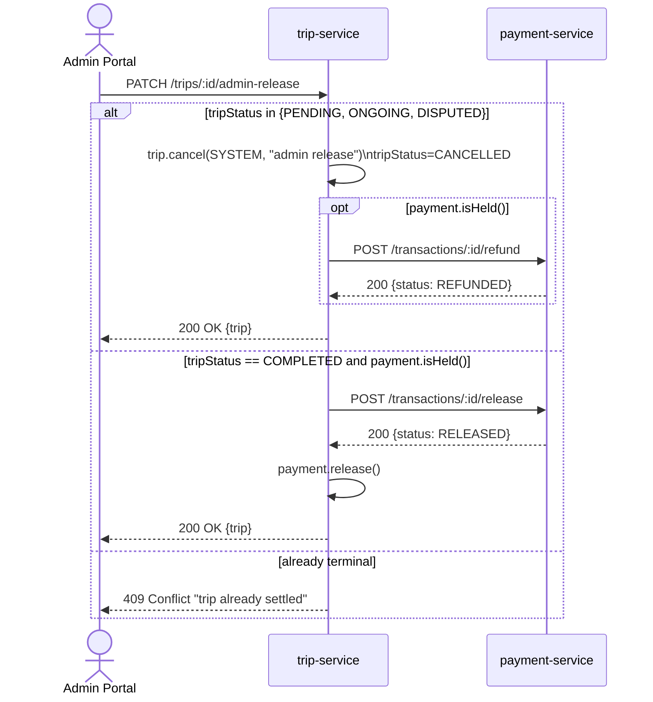

# Sequence Diagrams

## 1. Ride Booking & Rider Matching

Covers `POST /trips`, the fare prediction call to `pricing-service`, and the
event-driven matching flow (`trip.created` → `matching.events` → rider offer
→ `lock-broadcast`).

## 2. Trip Lifecycle: Pickup → Completion → Payment Release

## 3. Package Delivery Flow

Covers parcel creation, the resulting `PACKAGE` trip, assignment, and the
delivery status progression including optional cash-on-delivery (COD).

## 4. Cancellation, Dispute & Rebroadcast

## 5. Admin: Release a Stuck Trip

Covers the `admin-release` escape hatch used by the admin portal's
"Release Stale Trip" action.

