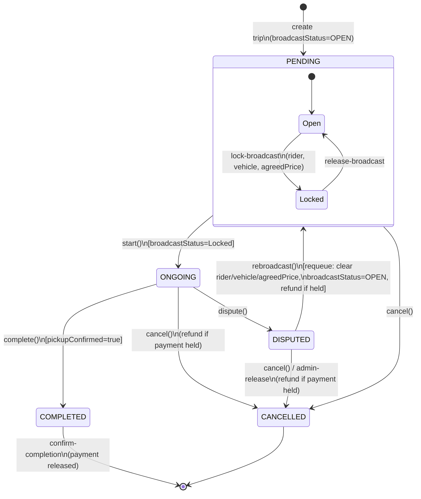
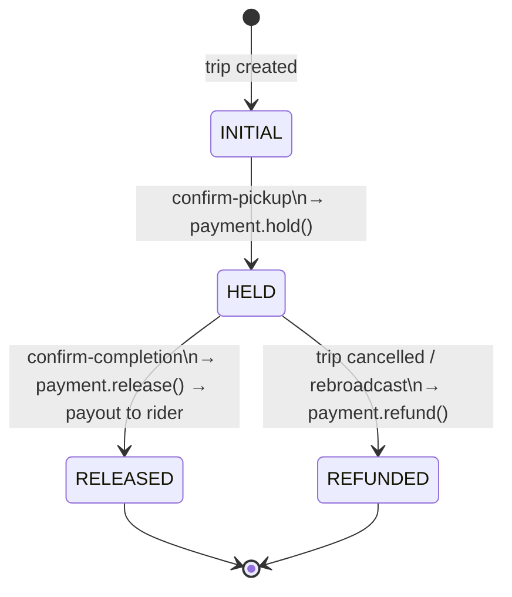
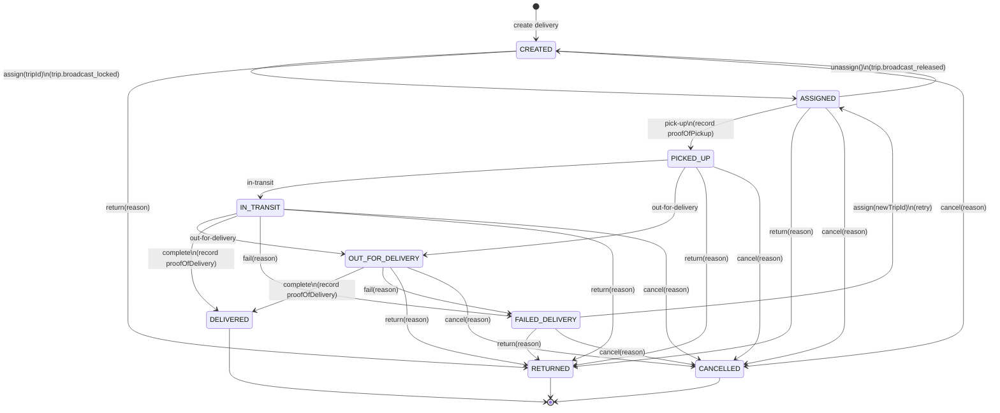
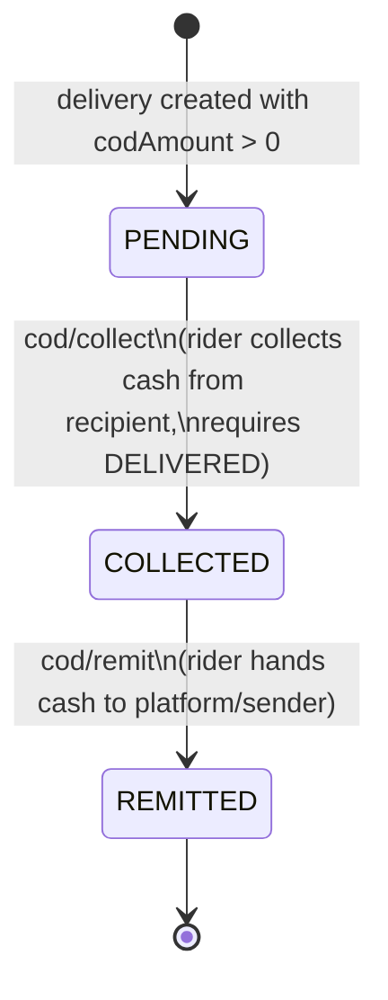

# State Machine Diagrams

## 1. Trip Status (`trip-service`)

`broadcastStatus` is modelled as a nested region of `PENDING`, since locking
and releasing the broadcast only makes sense while the trip is still pending.

## 2. Payment Status (within `Trip.payment`)

## 3. Delivery Status (`delivery-service`)

## 4. Cash-on-Delivery (COD) Status (within `Delivery.codInfo`)

Only present when the delivery was created with a `codAmount > 0`.

