# Use Case Diagram

Actors:
- **Passenger** — end user of the mobile app who books rides and ships parcels (`Courier-Management-system`, `userType: USER`)
- **Rider / Courier** — end user of the mobile app who fulfils trips and deliveries (`userType: RIDER`)
- **Admin** — staff user of the web portal (`CourierAdmin`)
- **System** — automated background actors: matching-service, notification-service, the outbox publishers and the ML pricing model

Mermaid has no native UML use-case shape, so actors are drawn as rectangles and
use cases as stadium-shaped nodes, grouped by domain area inside subgraphs.

```mermaid
flowchart LR
    Passenger["🧑 Passenger"]
    Rider["🛵 Rider / Courier"]
    Admin["🛠️ Admin"]
    System["⚙️ System\n(matching / notification / pricing)"]

    subgraph AUTH["Account & Profile"]
        UC_Register(["Register account"])
        UC_Login(["Login"])
        UC_SelectRole(["Select role: Passenger / Rider"])
        UC_RegisterRider(["Register as Rider + vehicle"])
        UC_ManageProfile(["View / edit profile"])
        UC_ChangePassword(["Change password"])
        UC_ManageVehicles(["Add / remove vehicle"])
    end

    subgraph RIDE["Ride Management"]
        UC_BookRide(["Book a ride"])
        UC_GetFareEstimate(["Get fare estimate"])
        UC_TrackTrip(["Track active trip"])
        UC_ViewTripHistory(["View trip history"])
        UC_CancelTrip(["Cancel trip"])
        UC_RebroadcastTrip(["Rebroadcast trip"])
        UC_AcceptTripOffer(["Accept / decline trip offer"])
        UC_ConfirmPickup(["Confirm pickup"])
        UC_StartTrip(["Start trip"])
        UC_CompleteTrip(["Complete trip"])
        UC_ConfirmCompletion(["Confirm completion & release payment"])
        UC_HandoffTrip(["Hand off trip to another rider"])
    end

    subgraph DELIVERY["Delivery / Package Management"]
        UC_BookDelivery(["Book parcel delivery"])
        UC_UploadParcelPhotos(["Upload parcel photos"])
        UC_TrackDelivery(["Track delivery by tracking number"])
        UC_ViewDeliveryHistory(["View delivery history"])
        UC_CancelDelivery(["Cancel delivery"])
        UC_RecordPickup(["Record pickup proof"])
        UC_UpdateDeliveryStatus(["Update delivery status\n(in transit / out for delivery)"])
        UC_RecordCompletion(["Record delivery proof"])
        UC_RecordFailedAttempt(["Record failed delivery attempt"])
        UC_ReturnDelivery(["Return delivery to sender"])
        UC_CollectCod(["Collect cash on delivery"])
        UC_RemitCod(["Remit collected COD"])
    end

    subgraph WALLET["Wallet & Payments"]
        UC_OpenAccount(["Open wallet account"])
        UC_ViewWallet(["View balance & transactions"])
        UC_TopUp(["Top up wallet"])
        UC_Withdraw(["Withdraw funds"])
    end

    subgraph RIDER_OPS["Rider Operations"]
        UC_GoOnline(["Go online / offline"])
        UC_ShareLocation(["Share live location"])
        UC_ViewEarnings(["View earnings"])
    end

    subgraph SUPPORT["Dispute & Support"]
        UC_FlagDispute(["Flag trip dispute"])
        UC_ResolveDispute(["Resolve dispute\n(complete / cancel + refund)"])
    end

    subgraph ADMIN_OPS["Platform Administration"]
        UC_ViewDashboard(["View platform dashboard"])
        UC_ManageUsers(["Manage users\n(view / edit / deactivate / delete)"])
        UC_ManageRiders(["Manage riders & vehicles"])
        UC_ManageTrips(["Manage trips\n(view / cancel / complete)"])
        UC_AdminReleaseTrip(["Admin-release stuck trip"])
        UC_ManageDeliveries(["Manage deliveries\n(view / return / cancel)"])
        UC_ManageWallets(["Manage wallet accounts\n(top up / withdraw)"])
    end

    subgraph AUTOMATION["Automated Processes"]
        UC_PredictFare(["Predict trip fare\n(pricing-service ML model)"])
        UC_MatchRider(["Match trip with nearby riders"])
        UC_SendNotifications(["Send push / email / SMS notifications"])
        UC_PublishEvents(["Publish domain events\n(outbox → Kafka)"])
    end

    %% Passenger associations
    Passenger --> UC_Register & UC_Login & UC_SelectRole & UC_ManageProfile & UC_ChangePassword
    Passenger --> UC_BookRide & UC_GetFareEstimate & UC_TrackTrip & UC_ViewTripHistory & UC_CancelTrip & UC_RebroadcastTrip & UC_ConfirmCompletion
    Passenger --> UC_BookDelivery & UC_UploadParcelPhotos & UC_TrackDelivery & UC_ViewDeliveryHistory & UC_CancelDelivery
    Passenger --> UC_OpenAccount & UC_ViewWallet & UC_TopUp & UC_Withdraw
    Passenger --> UC_FlagDispute

    %% Rider associations
    Rider --> UC_Register & UC_Login & UC_SelectRole & UC_RegisterRider & UC_ManageProfile & UC_ChangePassword & UC_ManageVehicles
    Rider --> UC_AcceptTripOffer & UC_ConfirmPickup & UC_StartTrip & UC_CompleteTrip & UC_TrackTrip & UC_HandoffTrip & UC_CancelTrip
    Rider --> UC_RecordPickup & UC_UpdateDeliveryStatus & UC_RecordCompletion & UC_RecordFailedAttempt & UC_CollectCod
    Rider --> UC_OpenAccount & UC_ViewWallet & UC_TopUp & UC_Withdraw & UC_ViewEarnings
    Rider --> UC_GoOnline & UC_ShareLocation
    Rider --> UC_FlagDispute

    %% Admin associations
    Admin --> UC_Login
    Admin --> UC_ViewDashboard & UC_ManageUsers & UC_ManageRiders & UC_ManageTrips & UC_AdminReleaseTrip & UC_ManageDeliveries & UC_ManageWallets & UC_ResolveDispute & UC_RemitCod

    %% System associations
    System --> UC_PredictFare & UC_MatchRider & UC_SendNotifications & UC_PublishEvents

    %% Cross-cutting includes
    UC_BookRide -.->|includes| UC_PredictFare
    UC_BookRide -.->|triggers| UC_MatchRider
    UC_BookDelivery -.->|triggers| UC_PublishEvents
    UC_PublishEvents -.->|triggers| UC_SendNotifications
    UC_ConfirmCompletion -.->|includes| UC_ResolveDispute
```

