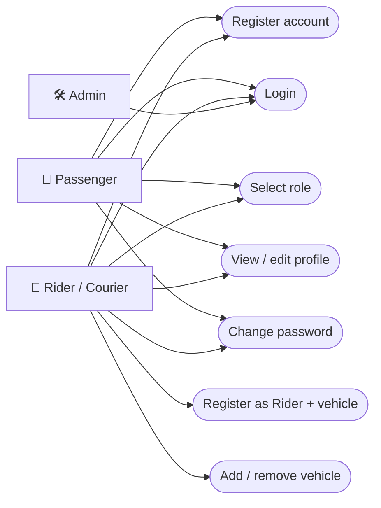

# Use Case Diagram — Account & Profile Management

Actors: **Passenger**, **Rider / Courier**, **Admin**.

```mermaid
flowchart LR

    Passenger["🧑 Passenger"]
    Rider["🛵 Rider / Courier"]
    Admin["🛠️ Admin"]

    UC_Register(["Register account"])
    UC_Login(["Login"])
    UC_SelectRole(["Select role"])
    UC_RegisterRider(["Register as Rider + vehicle"])
    UC_ManageProfile(["View / edit profile"])
    UC_ChangePassword(["Change password"])
    UC_ManageVehicles(["Add / remove vehicle"])

    Passenger --> UC_Register
    Passenger --> UC_Login
    Passenger --> UC_SelectRole
    Passenger --> UC_ManageProfile
    Passenger --> UC_ChangePassword

    Rider --> UC_Register
    Rider --> UC_Login
    Rider --> UC_SelectRole
    Rider --> UC_RegisterRider
    Rider --> UC_ManageProfile
    Rider --> UC_ChangePassword
    Rider --> UC_ManageVehicles

    Admin --> UC_Login
```
