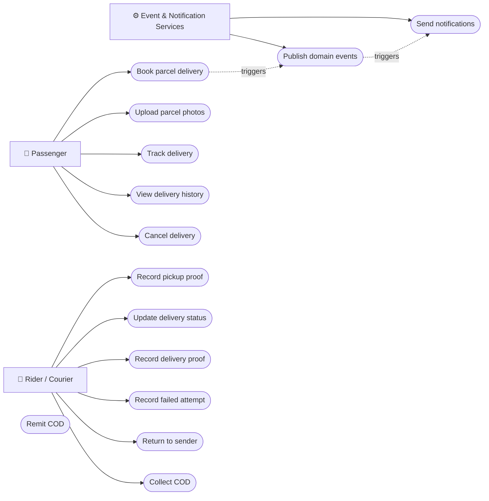

# Use Case Diagram — Delivery / Parcel Management

Actors: **Passenger**, **Rider / Courier**, **System** (event & notification services).

```mermaid
flowchart LR

    Passenger["🧑 Passenger"]
    Rider["🛵 Rider / Courier"]
    System["⚙️ Event & Notification Services"]

    UC_BookDelivery(["Book parcel delivery"])
    UC_UploadParcelPhotos(["Upload parcel photos"])
    UC_TrackDelivery(["Track delivery"])
    UC_ViewDeliveryHistory(["View delivery history"])
    UC_CancelDelivery(["Cancel delivery"])

    UC_RecordPickup(["Record pickup proof"])
    UC_UpdateDeliveryStatus(["Update delivery status"])
    UC_RecordCompletion(["Record delivery proof"])
    UC_RecordFailedAttempt(["Record failed attempt"])
    UC_ReturnDelivery(["Return to sender"])
    UC_CollectCod(["Collect COD"])
    UC_RemitCod(["Remit COD"])

    UC_PublishEvents(["Publish domain events"])
    UC_SendNotifications(["Send notifications"])

    Passenger --> UC_BookDelivery
    Passenger --> UC_UploadParcelPhotos
    Passenger --> UC_TrackDelivery
    Passenger --> UC_ViewDeliveryHistory
    Passenger --> UC_CancelDelivery

    Rider --> UC_RecordPickup
    Rider --> UC_UpdateDeliveryStatus
    Rider --> UC_RecordCompletion
    Rider --> UC_RecordFailedAttempt
    Rider --> UC_ReturnDelivery
    Rider --> UC_CollectCod

    System --> UC_PublishEvents
    System --> UC_SendNotifications

    UC_BookDelivery -.->|triggers| UC_PublishEvents
    UC_PublishEvents -.->|triggers| UC_SendNotifications
```
