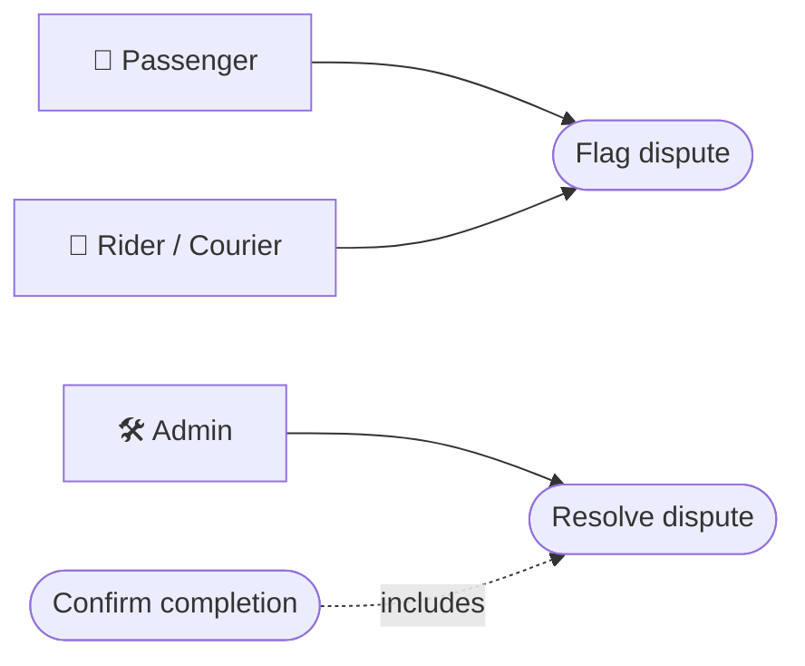

# Use Case Diagram — Dispute & Support Management

Actors: **Passenger**, **Rider / Courier**, **Admin**.

```mermaid
flowchart LR

    Passenger["🧑 Passenger"]
    Rider["🛵 Rider / Courier"]
    Admin["🛠️ Admin"]

    UC_FlagDispute(["Flag dispute"])
    UC_ResolveDispute(["Resolve dispute"])
    UC_ConfirmCompletion(["Confirm completion"])

    Passenger --> UC_FlagDispute
    Rider --> UC_FlagDispute

    Admin --> UC_ResolveDispute

    UC_ConfirmCompletion -.->|includes| UC_ResolveDispute
```
