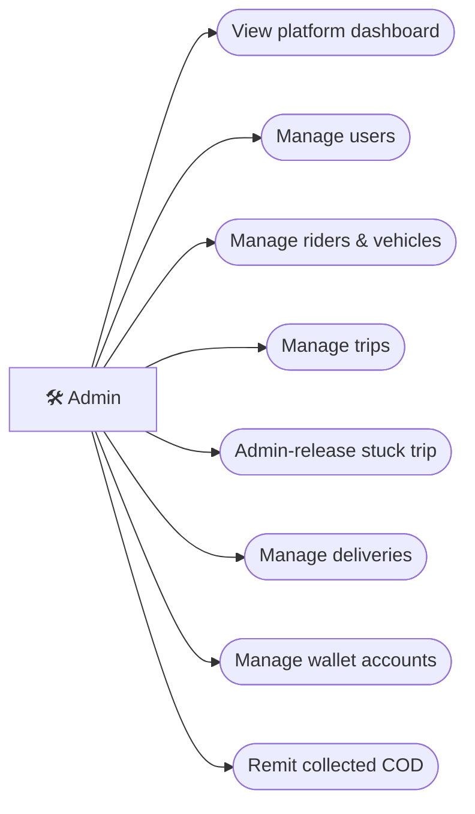

# Use Case Diagram — Platform Administration

Actor: **Admin**.

```mermaid
flowchart LR

    Admin["🛠️ Admin"]

    UC_ViewDashboard(["View platform dashboard"])
    UC_ManageUsers(["Manage users"])
    UC_ManageRiders(["Manage riders & vehicles"])
    UC_ManageTrips(["Manage trips"])
    UC_AdminReleaseTrip(["Admin-release stuck trip"])
    UC_ManageDeliveries(["Manage deliveries"])
    UC_ManageWallets(["Manage wallet accounts"])
    UC_RemitCod(["Remit collected COD"])

    Admin --> UC_ViewDashboard
    Admin --> UC_ManageUsers
    Admin --> UC_ManageRiders
    Admin --> UC_ManageTrips
    Admin --> UC_AdminReleaseTrip
    Admin --> UC_ManageDeliveries
    Admin --> UC_ManageWallets
    Admin --> UC_RemitCod
```
