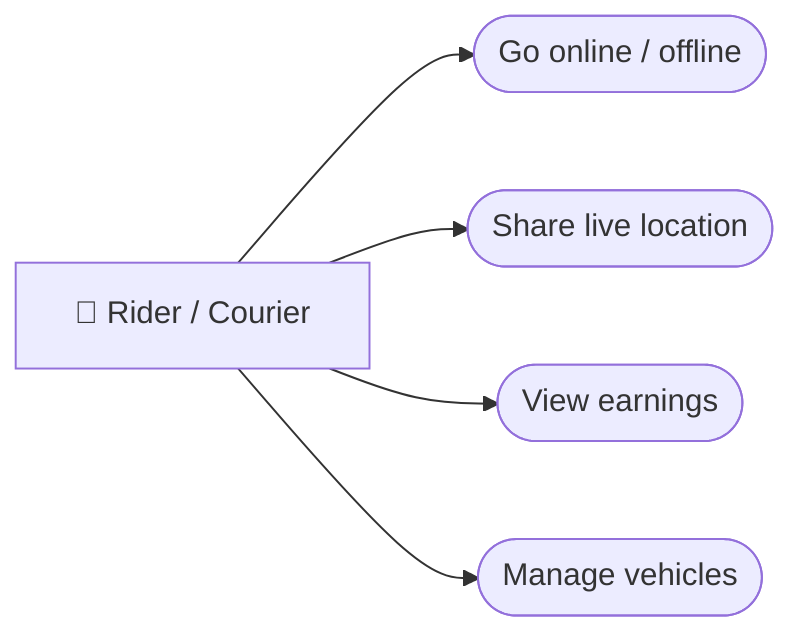

# Use Case Diagram — Rider Operations

Actor: **Rider / Courier**.

```mermaid
flowchart LR

    Rider["🛵 Rider / Courier"]

    UC_GoOnline(["Go online / offline"])
    UC_ShareLocation(["Share live location"])
    UC_ViewEarnings(["View earnings"])
    UC_ManageVehicles(["Manage vehicles"])

    Rider --> UC_GoOnline
    Rider --> UC_ShareLocation
    Rider --> UC_ViewEarnings
    Rider --> UC_ManageVehicles
```
