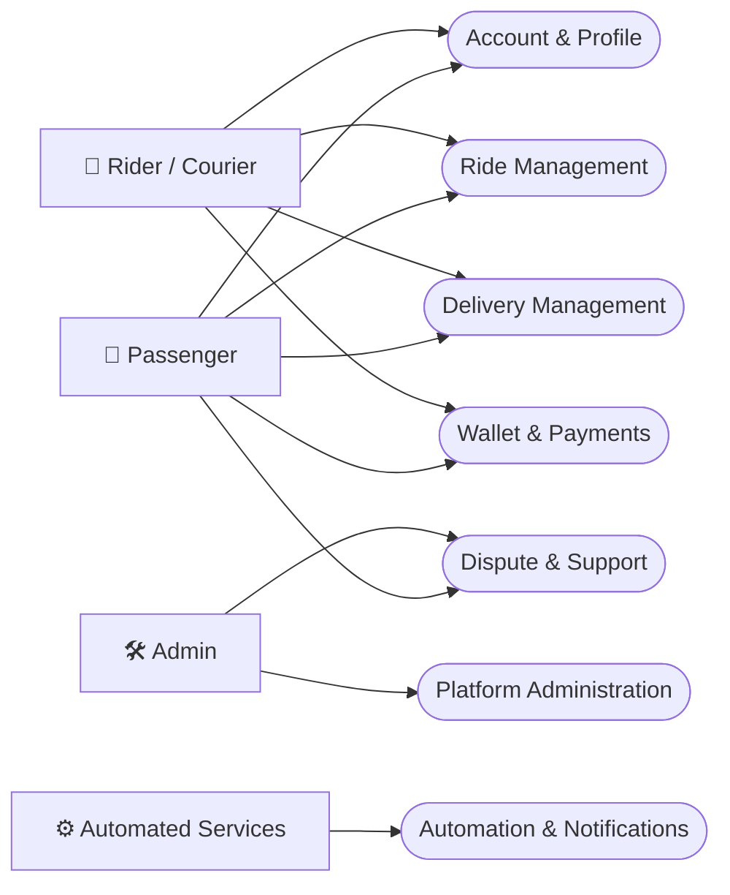

# Use Case Diagram — System Overview

High-level map of which actor groups interact with which domain areas. Each
domain area is detailed in its own diagram in this folder.

```mermaid
flowchart LR

    Passenger["🧑 Passenger"]
    Rider["🛵 Rider / Courier"]
    Admin["🛠️ Admin"]
    System["⚙️ Automated Services"]

    AUTH(["Account & Profile"])
    RIDE(["Ride Management"])
    DELIVERY(["Delivery Management"])
    WALLET(["Wallet & Payments"])
    SUPPORT(["Dispute & Support"])
    ADMIN_OPS(["Platform Administration"])
    AUTOMATION(["Automation & Notifications"])

    Passenger --> AUTH
    Passenger --> RIDE
    Passenger --> DELIVERY
    Passenger --> WALLET
    Passenger --> SUPPORT

    Rider --> AUTH
    Rider --> RIDE
    Rider --> DELIVERY
    Rider --> WALLET

    Admin --> ADMIN_OPS
    Admin --> SUPPORT

    System --> AUTOMATION
```
