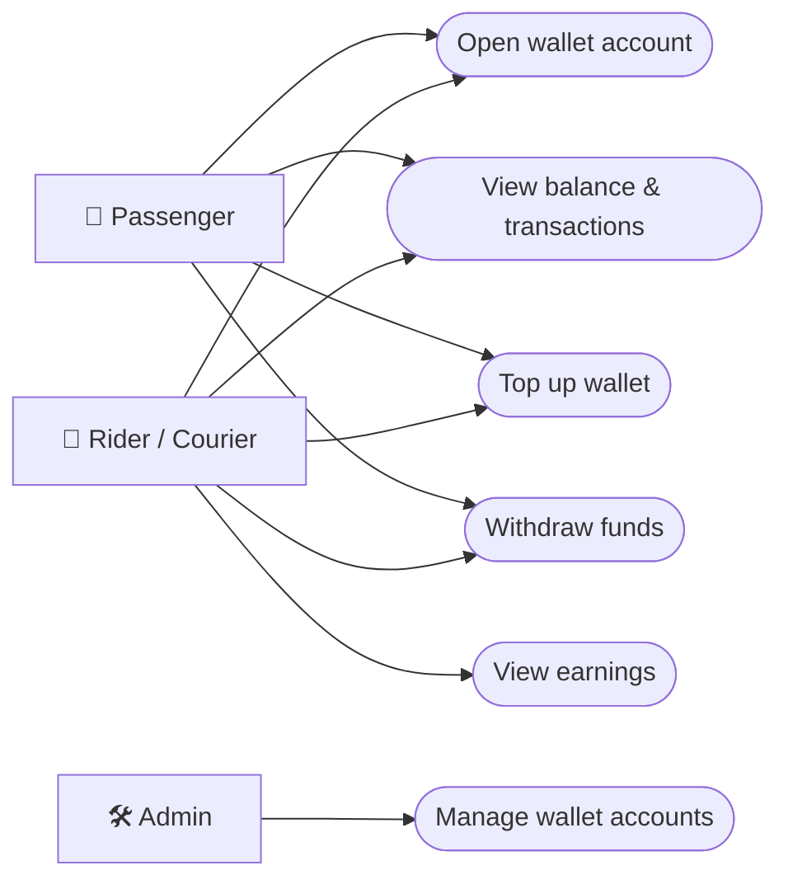

# Use Case Diagram — Wallet & Payments

Actors: **Passenger**, **Rider / Courier**, **Admin**.

```mermaid
flowchart LR

    Passenger["🧑 Passenger"]
    Rider["🛵 Rider / Courier"]
    Admin["🛠️ Admin"]

    UC_OpenAccount(["Open wallet account"])
    UC_ViewWallet(["View balance & transactions"])
    UC_TopUp(["Top up wallet"])
    UC_Withdraw(["Withdraw funds"])
    UC_ViewEarnings(["View earnings"])
    UC_ManageWallets(["Manage wallet accounts"])

    Passenger --> UC_OpenAccount
    Passenger --> UC_ViewWallet
    Passenger --> UC_TopUp
    Passenger --> UC_Withdraw

    Rider --> UC_OpenAccount
    Rider --> UC_ViewWallet
    Rider --> UC_TopUp
    Rider --> UC_Withdraw
    Rider --> UC_ViewEarnings

    Admin --> UC_ManageWallets
```
